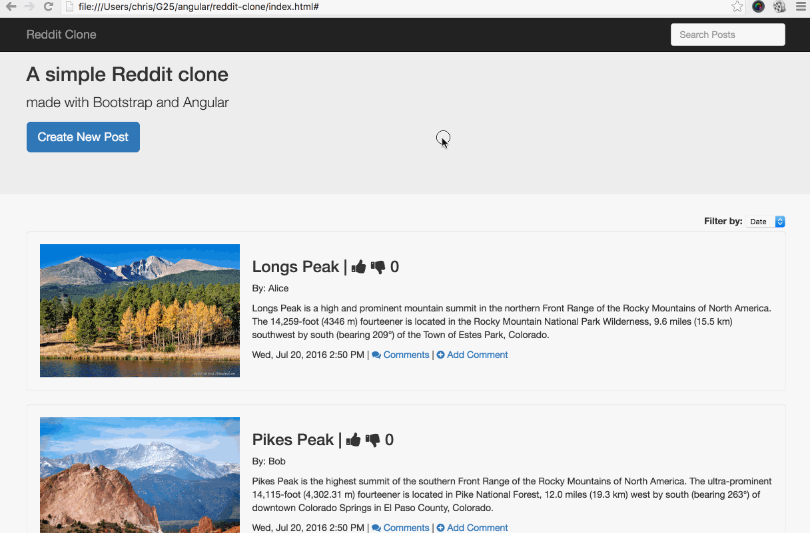

# Simple Reddit Clone With Bootstrap and AngularJS

A small project to practice AngularJS.



## Built With

* [AngularJS](https://angularjs.org/)
* [Bootstrap](https://getbootstrap.com/)

## Run It Locally

Run the app on your machine like so:

1. Open your Terminal app:
2. Run the following commands:

````
$ git clone git@github.com:chrisco/reddit-clone.git
$ cd reddit-clone
$ open index.html
````

## Specs

* All post data should only be stored in a controller or service.
* A page refresh will clear all added posts.
* You do not have to make any ajax requests or actually contact the reddit API.
* Each post has a title, author, image, and description.
* __TODO__: Each post's date/time is displayed nicely: "Yesterday at 3:09pm", "Last Thursday at 4:42am", etc. You will need an external library. Watch the video for more details.
* A user can upvote / downvote posts.
* Posts dynamically reorder according to number of votes.
* A user can create new posts.
* __V1 DONE__: A user cannot create a new post if any of the 4 inputs are blank. Research angular validations. See the video for an example implementation.
* A user can click to view existing comments on a specific post.
* The number of comments is correctly pluralized.
* A user can add a new comment to a specific post.
* The new post form and comment forms can be toggled on and off.
* A user can search through posts.
* A user can sort posts by votes, date, and title.
* __DOING__: Animate posts as they are added and removed from the search results. Research Angular animations. See the video for an example implementation and links below for hints.
* __V1 DONE__: Style the app. It should look better than my implementation.

__Bonus Features__

* TODO: A user can choose to sort ascending or descending.
* TODO: A user can favorite posts and view all favorites in a separate tab.
* TODO: A user can upload an image (no backend involved).

__Animation-related Links__

* http://plnkr.co/edit/qrQwv1?p=preview
* https://divshot.com/blog/tips-and-tricks/angular-1-2-and-animate-css/
* http://odetocode.com/blogs/scott/archive/2014/02/25/easy-animations-for-angularjs-with-animate-css.aspx

__Other Links__

* [Galvanize Article](https://learn.galvanize.com/cohorts/66/articles/2972)
* [Galvanize Video]( https://github.com/gSchool/angular-curriculum/blob/master/Unit-1/11-reddit-clone.md)
* [John Papa's Angular Style Guide](https://github.com/johnpapa/angular-styleguide)
